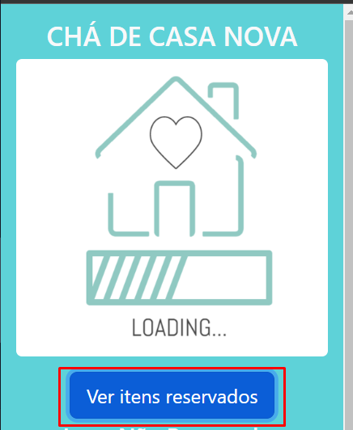
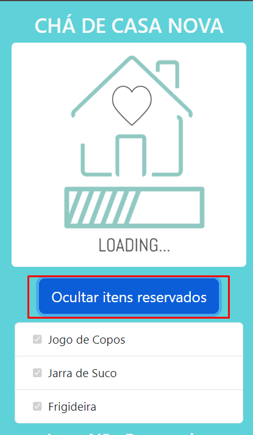
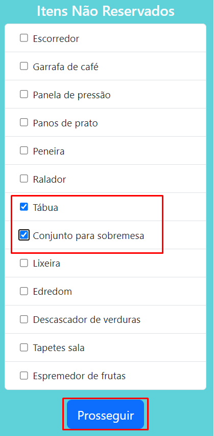
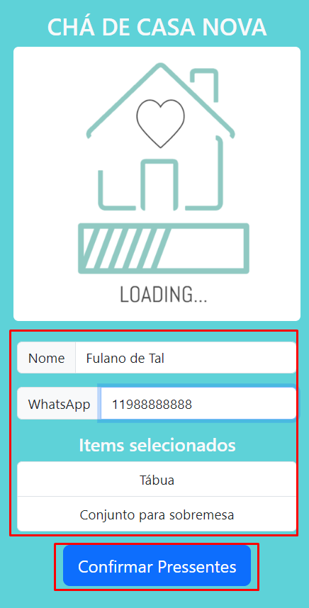
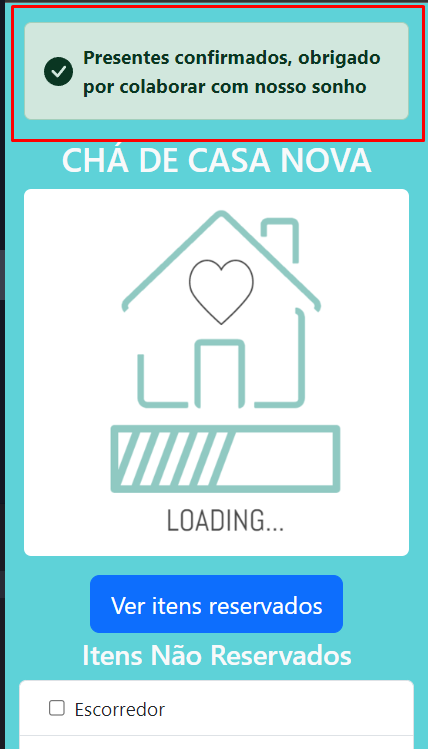
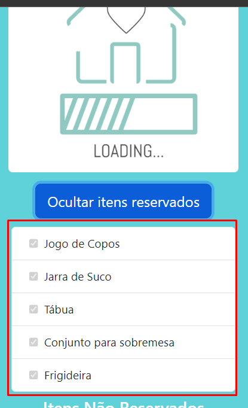

## OBJETIVO DO PROJETO
Recentemente estou planejando minha mudança de casa, estou saindo da casa dos meus pais para morar com minha namorada. Com essa mudança tivemos a ideia de fazer um [chá de casa nova](https://emcasa.com/blog/dia-a-dia/cha-de-casa-nova/), procuramos por alguma solução automatizada na WEB para criar nossa lista de presentes e marcar atribuir os mesmos aos nossos convidados, mas infelizmente não conseguimos encontrar nada que nos agradasse, então me veio a mente a ideia de desenvolver minha própria aplicação para solucionar o nosso problema de uma maneira simples.

## PRÉ-REQUISITOS
 - Node
 - Express
 - MongoDB

## COMO UTILIZAR
### Overview
O Fluxo do projeto é simples, basta o usuário (dev) fazer uma requisição para um end-point da própria aplicação utilizando o método **POST** e passando no corpo da requisição uma lista(**array**) de presentes. A estrutura da lista mencionada anteriormente deve seguir o seguinte padrão:
````
[
    {
        "name": "Gift1",
        "status": "available",
        "whatsapp": "00000000000",
        "owner" : "Admin"
    },
    {
        "name": "Gift2",
        "status": "available",
        "whatsapp": "00000000000",
        "owner" : "Admin"
    },
    ...
]
````

Após esta requisição a lista estará no banco de dados com os valores padrão. 

### Instalação
A instalação é bem simples:
- Clone este repositório

- Altere os path de algumas partes como nos arquivos:
    - ./package.json
    - /newHouse/src/app.js

- Altere a URL para a URL da sua aplicação:
    - /newHouse/public/scripts/index.js

- Execute o comando **`npm install`** para instalar as dependências

- E por fim execute o comando **`npm run start`** para iniciar o servidor


### Utilizando a interface WEB
A interface WEB é bem intuitiva, acesse-a em **http://sua-url-aqui:8100/index.html**. 

> **NOTA:**
> Não se esqueça de alterar o domínio

**1.º**  Você pode ver, clicar no botão **Ver itens reservados** e ver a lista de presentes que estão indisponíveis que já foram escolhidos pelos usuários, esta lista permanecerá vazia até algum usuário selecionar algum presente:
<br>

<br>


**2.º**  Você pode ver a lista de presentes disponíveis onde basta selecionar um ou mais e clicar em **Prosseguir** para seguir o fluxo da aplicação:
<br>


**3.º** Agora basta preencher um simples formulário e confirmar os presentes selecionados na etapa anterior clicando em **Confirmar Presentes**:
<br>


**4.º** Uma mensagem de sucesso irá aparecer indicando que tudo correu bem:
<br>
 

**5.º** Por fim, sua lista estará atualizada de forma dinâmica:
<br>

